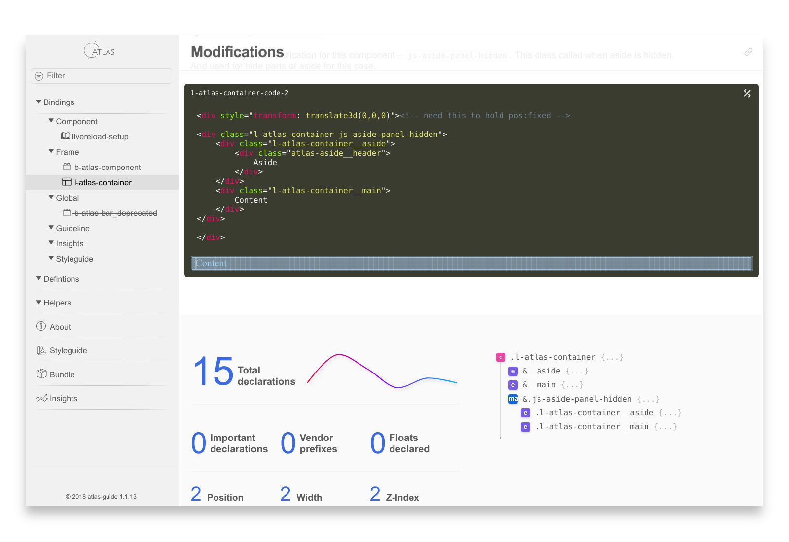

# Atlas-guide

[](https://coveralls.io/github/dimanech/atlas-guide?branch=master)
[](https://codeclimate.com/github/dimanech/atlas-guide/maintainability)
[](https://travis-ci.org/dimanech/atlas-guide/)
[](https://ci.appveyor.com/project/dimanech/atlas-guide/branch/master)
[](https://greenkeeper.io/)
[](https://badge.fury.io/js/atlas-guide)

Atlas is living style-guide, pattern library, guidelines and documentation static site generator with extensive 
styles monitoring and Sass components reports.

It is opinionated because it is probably impossible to cover all cases in CSS/Sass.

[Live example](https://dimanech.github.io/atlas-guide/)



## Features

* blazing fast thanks to Mustache and Marked. It primary designed as development platform;
* supports incremental builds. You could build pages only on start, and rebuild changed pages separately;
* could be setup with live reload and used as standalone development platform;
* small dependencies (Mustache, Marked, PostCSS, CSSStats, ImportsGraph, D3 parts, Lodash parts);
* extremely flexible. All internal templates could be overwritten on project level;
* could be used as simple guide docs;
* Hologram compatible (but do not use front matter section).

### Components library

Support `/*md` comment in `scss` files where regular markdown could be placed.

* comes with simple playground, so code examples could be live-edited, previewed and copy-and-pasted;
* comes with different types of pages - component, guide and reports and could be expanded to many different types;
* filtering and easy navigation over components;
* navigation tree copy project tree, to ease orientation and successful handling huge components library;
* component local variables, internal and external dependencies;
* component raw structure;
* component statistic;
* compatibility with declared constants (if they declared);
* autogenerated styleguide based on project constants.

### Guide

Support regular markdown files in components tree and process it as guideline pages.

* markdown support
* table of contents for guidelines pages
* permalinks to sections
* do/not-do colorized examples

### Reports

* imports graph
* cross components dependencies graph
* project statistical reports
    * basic statistics
    * file sizes comparison
    * data uri size and used data stat
    * specificity graph and heaviest, longest selectors list
    * ruleset size and heaviest, empty rulesets list
    * total vs uniq declaration of style and metric properties

## Getting started

```
npm install atlas-guide
```

`.atlasrc.json`:

```json
{
    "guideSrc": "assets/scss/",
    "guideDest": "guide/",
    "cssSrc": "assets/css/"
}
```

Then in package.json

```json
{
  "scripts": {
    "build-atlas": "atlas-guide --build"
  }
}
```

```
npm run build-atlas
```

### API

```js
const atlas = require('atlas-guide');
atlas.build(); // build all guide files without reports. Return promise.
atlas.build('path/to/changed/file.scss'); // compile only particular file, if it marked as documented in project tree
atlas.buildAll(); // compile all guide and reports. Return promise.
```

Use `atlas.build()` for incremental development builds, where it is not required to have extensive heavy-weight statistic.

### CLI

```shell
Usage: atlas-guide [option]

Options:            
  --build                    build all atlas pages
  -v, --version              print Atlas-guide version
  --help                     print this message
```

## Configuration

Atlas search configuration in this order:

1. `.atlasrc.json` in project root 
2. `atlasConfig` field in `package.json`

### `.atlasrc.json`

By default atlas search for configuration in `.atlasrc.json` file in the root of the project.

Minimal configuration:

```json
{
    "guideSrc": "assets/scss/",
    "guideDest": "guide/",
    "cssSrc": "assets/css/"
}
```

### `atlasConfig` in `package.json`

If you project stores all configurations in `package.json` you probably want to store atlas configuration here also. 
To do that add `atlasConfig` field to your `package.json`.

Note: if you have both `.atlasrc.json` and `package.json` -- `.atlasrc.json` will be used.

Minimal configuration:

```json
{
  "name": "some-project",
  "version": "0.0.1",
  "atlasConfig": {
    "guideSrc": "assets/scss/",
    "guideDest": "guide/",
    "cssSrc": "assets/css/"
  }
}
```

### Templates overwrites

As the next step you, probably, want to add your project CSS and JS to render components examples properly. 
To make this happen you need to add `partials` to the config, with paths to templates:

```json
{
    "partials": {
      "assetshead": "guide/project-head.mustache",
      "assetsfooter": "guide/project-footer.mustache"
    }
}
```

...and add links to your project CSS/JS. Ex: `project-head.mustache`

```html
<link rel="stylesheet" type="text/css" href="../css/project.css"/>
<link rel="stylesheet" type="text/css" href="../css/additional.css"/>
```

`project-footer.mustache`:

```html
<script src="../js/bundle.js"></script>
```

Note, that paths should be related to generated HTML, no matter where templates are stored. This is simple include that
will be incorporated into resulted html.

All templates and partials in Atlas could be overwritten. Please see this repo views folder to get list of all templates 
and partials.

### All available configuration options

```json
{
    "guideSrc": "path/to/components/directory/",
    "guideDest": "path/where/atlas/will/be/placed/",
    "cssSrc": "path/to/css/",
    "scssSrc": "path/to/scss/",
    "scssAdditionalImportsArray": "",
    "componentPrefixes": ["b-", "l-"],
    "excludedCssFiles": "dev_",
    "excludedSassFiles": "dev_",
    "excludedDirs": "dev_",
    "copyInternalAssets": true,
    "templates": {
        "about": "",
        "bundle": "",
        "component": "",
        "guide": "",
        "insights": "",
        "styleguide": ""
    },
    "includes": {
        "aside": "",
        "assetsfooter": "",
        "assetshead": "",
        "componentstataside": "",
        "componentstatfooter": "",
        "componentstatstructure": "",
        "copyright": "",
        "footer": "",
        "header": "",
        "logo": "",
        "navigation": "",
        "toc": "",
        "welcome": ""
    },
    "projectConstants": {
        "constantsSrc": "path/to/project-settings.scss",
        "colorPrefix": "color",
        "fontPrefix": "font",
        "scalePrefix": "scale",
        "spacePrefix": "space",
        "motionPrefix": "motion",
        "depthPrefix": "depth",
        "breakpointPrefix": "break"
    }
}
```

`scssSrc` is optional. It should be used if `guideSrc` is different from scss root. If not defined `guideSrc` will be used.

## Usage

Atlas like Vim consists of two functions - beeping and corrupting files. But with minor difference. 
It generate guide and generate reports. You need to document code to make it "beeping" and provide config to make it 
generate files for you project properly. 

In this section we need to cover 2 topics - documenting, reports configuration.

### Documenting code

#### Doc comment

Add this comment to the scss file and it appears as guide page.

```scss
/*md

# Component name

 */
```

Inside this comment regular markdown syntax used, so any valid markdown will supported here. 

```scss
/*md

# Heading level 1

## Heading level 2

## Heading level 3

Regular paragraph with **bold**, _italic_ and `inline code`.

* list item
* list item
* list item

1. ordered list item
2. ordered list item
3. ordered list item

etc.

 */
```

Note: Please avoid some tricky markdown construction, because `marked` super fast, but with this comes not great smartness.

#### Component example

Atlas extended markdown code block "fences" notation with custom type (just like Hologram) -- `html_example`. 
That render component playground instead of code-example. This keeps documentation compatible with regular markdown.

To create component example you need to add code-block with `html_example`: 

```scss
/*md

``html_example
<h1>Add one more backtick to make this example working</h1>
``

*/
```

Just in case, it should not be indented like this, this is because the code below is markdown in markdown.

Simple `html`, `scss`, `css` "fences" become regular code-block:

```scss
/*md

``html
<h1>heading 1</h1>
``

``scss
.some { maring: 0; }
``

*/
```

#### Guideline/Documentation page

Simply put regular markdown file to components tree and they automatically become part of atlas.

#### Styling code "fences"

All "_" in code block "fences" will be removed, but original "fence" will be added as CSS-class, so you could
use it to style code by your needs. Atlas by default style 2 class `*_bad`, `*_good`. This is used in guidelines.

```md
``html_bad
<H1>Title</H1>
``

``html_good
<h1>Title</h1>
``
```

Bad/good screen

#### Template helpers

To inline some resources like svg icons, inlined styles etc. you could use `inline` helper. Ex:

```html
{{#inline}}assets/src/images/icons.svg{{/inline}}
```

### Build guide and reports

#### Incremental builds

Regular flow to build all guide pages on start and incrementally build pages on file changes:

```js
const atlas = require('atlas-guide');
atlas.build(); // build all guide files without reports
// watch for changes, get changed file path and build needed page:
atlas.build('path/to/changed/file.scss'); // compile only this file if was documented on module import
```

##### Gulp example

See example of configuration with gulp in `gulpfile.js` in this repo.

#### Full Atlas generation

Due to time efforts reports not generated in regular flow. To generate reports you need to call `npm atlas-guide --build-all`
or in node:

```js
const atlas = require('atlas-guide');
atlas.buildAll(); // compile all guide and reports
```

### Setup constants support

Could be a tricky part, because it required full sass compilation and has some limitations. First you need to use constants in simple form. Ex:

```scss
$color-violet: #594199;
$color-fuchsia: #bc1f8c;
$scale-sm: 0.8rem;
$scale-md: 1rem;
```

No lists, maps or functions that do some thing with it not supported.

Second. If you use additional import array in sass please add it to config first `"scssAdditionalImportsArray": ["path/to/additional/sass/files"]`.

Other steps is simple:

* add path to constants manifest file
* add prefixes that is used for different types of constants

```json
{
    "guideSrc": "path/to/components/directory/",
    "guideDest": "path/where/atlas/will/be/placed/",
    "cssSrc": "path/to/css/",
    "scssSrc": "path/to/scss/",
    "scssAdditionalImportsArray": ["path/to/additional/sass/files"],
    "projectConstants": {
        "constantsSrc": "path/to/project-settings.scss",
        "colorPrefix": "color",
        "fontPrefix": "font",
        "scalePrefix": "scale",
        "spacePrefix": "space",
        "motionPrefix": "motion",
        "depthPrefix": "depth",
        "breakpointPrefix": "break"
    }
}
```

After that styleguide page and components stat hints would be generated.

## Contributing

You are welcome for ideas, help and of course code contributing.

We have git hooks with all validation. Please install it manually on first time by run `npm run install:copyhooks`.

## License

Copyright © 2018, D. Nechepurenko. Published under MIT license.
